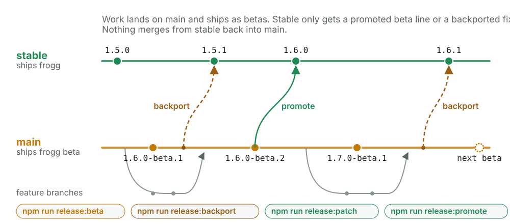
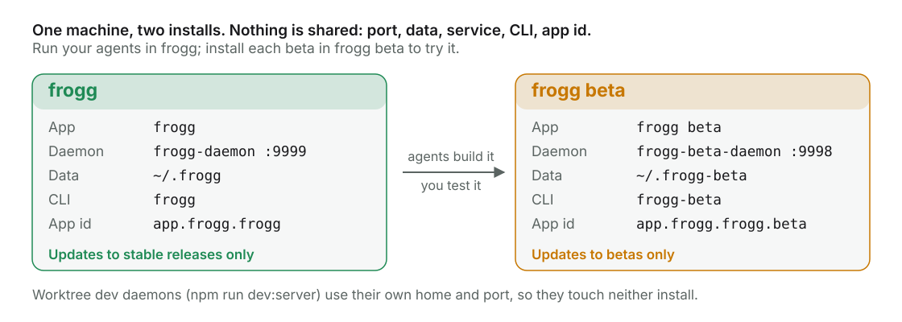
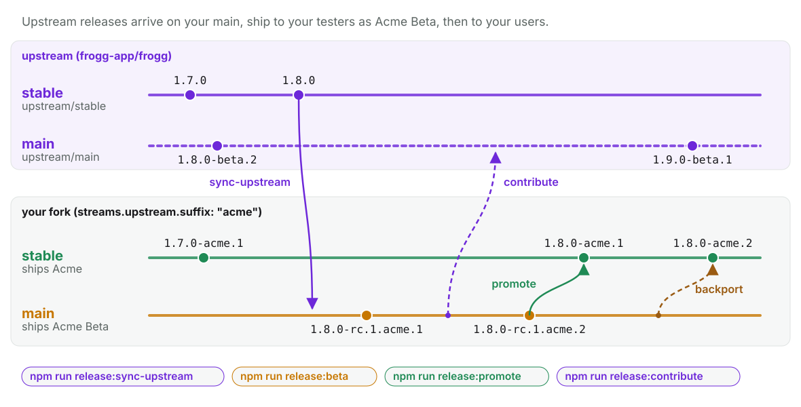
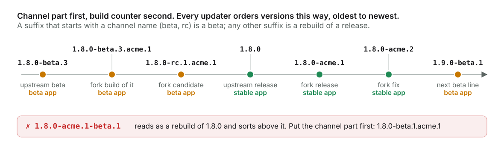

# Release streams

How frogg (and any fork of it) develops on a beta stream without disturbing stable users.
The full guide, with every command and option, is on the docs site:
[Release streams](https://frogg.app/docs/contributing/release-streams/). The diagrams are
generated by `node scripts/docs/stream-diagrams.mjs`.

## Two streams

<picture>
  <source media="(prefers-color-scheme: dark)" srcset="../website/src/assets/docs/diagrams/release-streams-dark.svg">
  
</picture>

| Branch   | Releases       | Ships as   | Cut with                                           |
| -------- | -------------- | ---------- | -------------------------------------------------- |
| `main`   | `X.Y.0-beta.N` | frogg beta | `npm run release:beta`                             |
| `stable` | `X.Y.Z`        | frogg      | `npm run release:promote`, `npm run release:patch` |

- Work lands on `main`. Pushing `main` never reaches stable users.
- A fix stable users need now: land it on `main`, then `npm run release:backport -- <commit>`
  on `stable` and `npm run release:patch`.
- A beta line that is ready: `npm run release:promote` on `stable`. It copies `main` onto
  `stable` and cuts `X.Y.0`.
- Nothing merges from `stable` into `main`. A fix made only on `stable` blocks promotion
  until it is cherry-picked onto `main`.
- `npm run streams` shows where each stream is and what has not moved yet. In the app, open
  **+ → Release streams** for the same picture as a graph.

## frogg beta installs beside frogg

<picture>
  <source media="(prefers-color-scheme: dark)" srcset="../website/src/assets/docs/diagrams/side-by-side-dark.svg">
  
</picture>

A beta tag builds the brand's beta channel: its own name, application id, daemon port, data
directory, service, CLI, URL scheme and `FROGG_BETA_*` environment, with a BETA ribbon on its
icons. Each build updates only within its own channel. Run your agents in frogg; install each
beta in frogg beta and try it on the same machine.

## Forks

<picture>
  <source media="(prefers-color-scheme: dark)" srcset="../website/src/assets/docs/diagrams/fork-streams-dark.svg">
  
</picture>

```json
{
  "streams": {
    "upstream": {
      "remote": "upstream",
      "repository": "frogg-app/frogg",
      "follow": "stable",
      "suffix": "acme"
    }
  }
}
```

1. `npm run release:sync-upstream` on `main` merges upstream's newest release.
2. `npm run release:beta` ships it to your testers as your beta (`1.8.0-rc.1.acme.1`).
3. `npm run release:promote` on `stable` ships it to your users (`1.8.0-acme.1`).
4. `npm run release:contribute -- <commit>` offers your own fixes back upstream.

## Versions

<picture>
  <source media="(prefers-color-scheme: dark)" srcset="../website/src/assets/docs/diagrams/version-order-dark.svg">
  
</picture>

A version is a beta when its suffix starts with a channel name (`beta`, `rc`, ...); any other
suffix is a fork's build counter on a stable release. The channel part always comes first:
`1.8.0-beta.1.acme.1`, never `1.8.0-acme.1-beta.1`. The rule lives in
`packages/protocol/src/release-version.ts` and `scripts/release/release-channel.mjs`, and a
test keeps the two in step.
