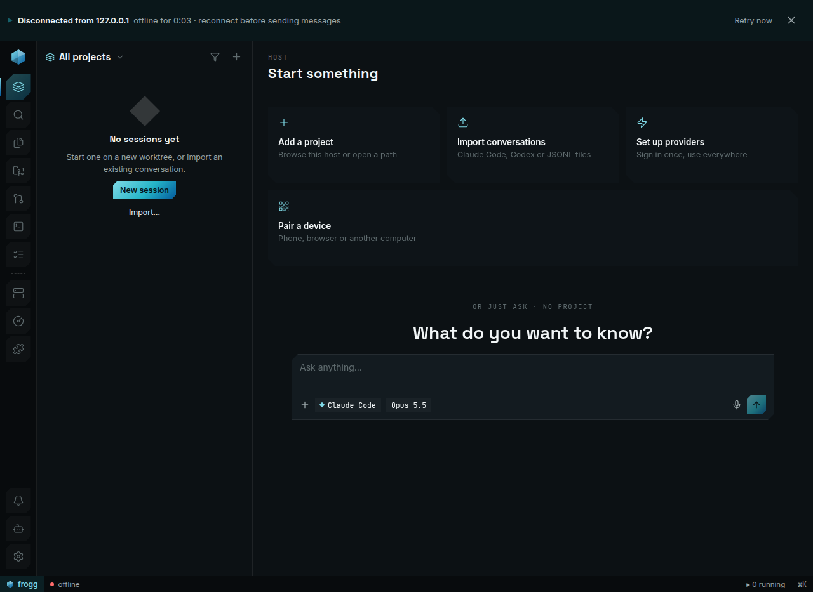
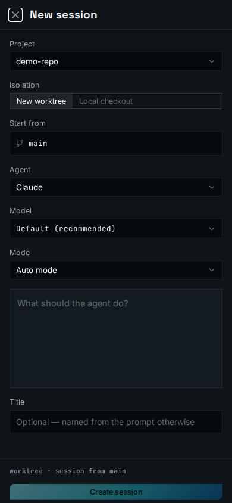
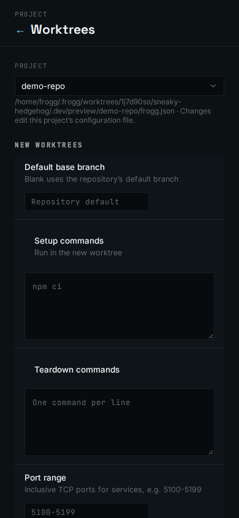
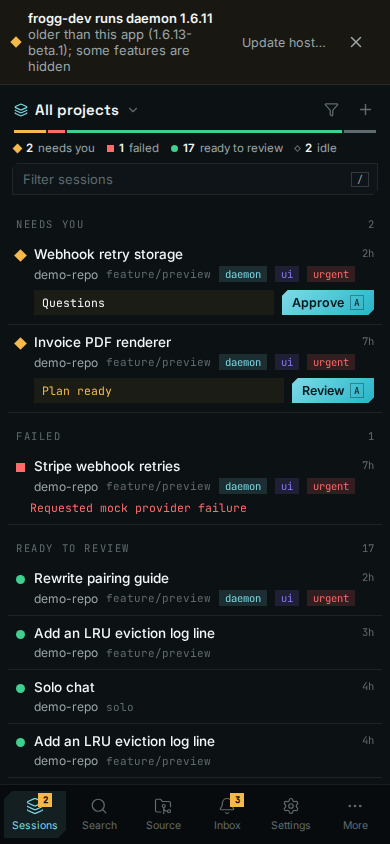

import { Steps } from "@/components/docs";

This page covers working on the Frogg monorepo itself. Commands run from the repository root
unless stated otherwise.

## Prerequisites

- **Node.js 22.** Root `package.json` requires `>=22`; `.tool-versions` pins `nodejs 22.20.0`.
  CI uses Node 22.
- **npm.** The repo uses npm workspaces (`packages/*`, `apps/*`) and a committed
  `package-lock.json`.
- **git.** Dev scripts use `git rev-parse --show-toplevel` to find the checkout root.
- **bash** for the dev scripts on macOS and Linux. On Windows use `npm run dev:win` (PowerShell).

`.tool-versions` also lists `rust`, `java` and `android-sdk`. Rust is only needed for the
inactive reference sources in `apps/desktop` and `apps/daemon-rs`. Java and the Android SDK
are needed for Android builds, see [Platform builds](#platform-builds).

## Install

```bash
npm ci
```

Install runs two hooks:

- `postinstall` applies `patches/*.patch` (`scripts/ci/postinstall-patches.mjs`) and runs
  `npm run brand:prepare`, which writes the selected brand to `.generated/branding/`.
- `prepare` installs the lefthook git hooks. It is skipped when `LEFTHOOK=0` or `CI=true`.

A new git worktree has no `node_modules`. Run `npm ci` in it before anything else, or the
pre-commit hook fails with `oxfmt: not found`.

## Build order

Workspaces import each other's built `dist/` output, not sibling `src/` files. npm does not
order the builds for you. The dependency chain is:

```
protocol → client → highlight, relay → server → cli
```

Use the root scripts. They encode the order.

| Script                    | Builds                                                         |
| ------------------------- | -------------------------------------------------------------- |
| `npm run build:protocol`  | `@frogg/protocol`                                                |
| `npm run build:client`    | `@frogg/protocol`, then `@frogg/client`                            |
| `npm run build:server-deps` | client chain, then highlight and relay in parallel          |
| `npm run build:server`    | server deps, then `@frogg/server` and `@frogg/cli`                 |
| `npm run build:app-deps`  | highlight, client and `@frogg/expo-two-way-audio`                |
| `npm run build:ui`        | Expo web export of `apps/ui` (runs `build:app-deps` first)     |
| `npm run build:desktop`   | web UI, then the Electron app-only shell                       |
| `npm run build:daemon-web-ui` | copies the web export into `packages/server/dist/server/web-ui` |

Most `build:*` scripts have a `:clean` variant, for example `npm run build:server:clean`,
which removes stale `dist/` first.

Which build to run after a change:

- `packages/protocol` or `packages/client`: `npm run build:client`.
- `packages/server`, `apps/cli`, `packages/relay` or `packages/highlight`: `npm run build:server`.
- Anything `apps/ui` consumes: `npm run build:app-deps`.

## Run the dev stack

Run the daemon and the client in separate terminals.

```bash
npm run dev:server   # daemon on 0.0.0.0:6768
npm run dev:app      # Expo (Metro) on port 8081, pointed at the dev daemon
```

- `dev:server` runs `build:server-deps` once, then watches protocol, client and server with
  `concurrently`. If the deps are already built, skip that step with
  `FROGG_SKIP_DEV_SERVER_BUILD=1 npm run dev:server`.
- `dev:app` sets `EXPO_PUBLIC_LOCAL_DAEMON` to the dev daemon endpoint and passes the current
  git branch as `EXPO_PUBLIC_FROGG_DEV_BUILD_LABEL`. `EXPO_PUBLIC_*` values are inlined at bundle
  time. Restart Metro after changing them.
- `npm run dev` is an alias for `dev:server`.
- `npm run dev:desktop` runs the Electron shell against a web dev server on port
  `18000 + <offset derived from the checkout path>` (override with `FROGG_ELECTRON_UI_PORT`).
  State lives in `.dev/electron/`. The shell is app-only: it never starts a daemon. Run a
  daemon yourself, for example `dev:server`, and add it as a host in the app.
- `npm run dev:win` runs `scripts/dev/dev.ps1`. It builds server and app deps, then runs the
  daemon watcher and Metro together in one PowerShell terminal.

The dev daemon and Expo bind `0.0.0.0` so they are reachable from other machines on the LAN.
To run any of these under a custom brand, use `npm run brand:dev`
([run the brand locally](/docs/fork-and-rebrand/branded-development/#run-the-brand-locally)).

Ports 6768 and 8081 are the defaults for the official brand. A custom brand selected with
`FROGG_BRAND_DIR` uses its `daemonPort` and `daemonPort + 1` instead. Port 9999 is the default
port of a separately installed daemon; keep it free of dev work.

## Preview UI changes

To iterate on screens without a full build, run the preview. It starts an isolated daemon and the
web app with hot reload, and seeds a demo project with uncommitted changes and two mock-provider
chats:

```bash
npm run preview            # fresh demo state on every launch
npm run preview -- --keep  # keep the previous run's daemon state
```

It prints a LAN URL (port 7800 by default, or `PREVIEW_PORT`; the daemon uses the next port).
Edits under `apps/ui` reload in the open page. Server changes need a restart of the preview;
use `npm run dev:live` when you are iterating on the daemon.

With the preview running, `npm run shot` captures a screen with headless Chromium in a few
seconds and writes it to `.dev/shots/`:

```bash
npm run shot                                    # the first seeded chat
npm run shot -- chat --mobile                   # phone viewport
npm run shot -- host/providers --click provider-settings-claude --wait provider-settings-modal
npm run shot -- chat --crop message-input-root --width 1800
npm run shot -- --help                          # every target and option
```

Targets are `chat`, `chat2`, `settings/<section>`, `host/<section>`, or any app route. `--click`
takes test IDs and can repeat to walk through a flow before the capture.

## Test a feature end to end

`npm run dev:live` runs this checkout's daemon and web app together against your real provider
logins, so a feature can be tried before it ships as a beta:

```bash
npm run dev:live
```

- It prints a LAN URL for the web app (port 7820 by default, or `PREVIEW_PORT`) and the daemon
  endpoint (the next port). Open the URL in any browser, or add the endpoint as a host in an
  installed Frogg app to drive the branch's daemon from the real client.
- Daemon state lives in `.dev/live/home` and survives restarts. Nothing is seeded.
- Edits under `apps/ui` hot-reload. Edits under `packages/server/src` restart the daemon in a few
  seconds, and so does rebuilding `packages/protocol` or `packages/client` (`npm run build:client`).
- `npm run shot -- --live` and `npm run probe -- --live` target it instead of the preview.

Which rung to use (the [development workflow](/docs/contributing/development-workflow/#test-locally-before-a-beta)
shows the whole ladder):

| Change touches                       | Test it with                                                   |
| ------------------------------------ | -------------------------------------------------------------- |
| UI layout, copy, styling             | `npm run preview`, then `npm run shot` / `npm run probe`       |
| A feature end to end, real providers | `npm run dev:live`, open the printed URL or add it as a host   |
| Daemon behaviour behind an app build | `npm run dev:live`, add its daemon endpoint as a host in the installed app |
| Electron shell, native bridge        | `npm run dev:desktop` on a machine with a display              |
| Packaging, installers, auto-update   | a beta build; nothing local covers these                       |

## Dev state

`FROGG_HOME` holds agents, projects, worktrees, `config.json` and `daemon.log`. The dev scripts
default it to `.dev/frogg-home` inside the current checkout, so dev work never touches `~/.frogg`.

```bash
FROGG_HOME=~/.frogg-blue npm run dev:server                 # explicit home
FROGG_DEV_SEED_HOME=~/.frogg npm run dev:server             # copy JSON metadata from another home
FROGG_DEV_SEED_HOME=~/.frogg FROGG_DEV_RESET_HOME=1 npm run dev:server   # clear, then reseed
```

Seeding copies `agents/**/*.json`, `projects/**/*.json` and `config.json`. It skips a home that
already has data unless `FROGG_DEV_RESET_HOME=1` is set.

:::caution
In `scripts/dev/dev-home.sh`, `FROGG_DEV_RESET_HOME` only takes effect together with
`FROGG_DEV_SEED_HOME`. On its own it does nothing.
:::

## Run the CLI from source

```bash
npm run cli -- ls -a -g
npm run cli -- daemon status
```

`npm run cli` runs `apps/cli/src/index.ts` with `tsx` through `scripts/dev/dev-home.sh`. It uses
the checkout's `.dev/frogg-home` and the dev daemon endpoint. An installed `frogg` binary is a
different build; use `npm run cli` to test CLI changes.

## Several checkouts at once

Each checkout or worktree gets its own `.dev/frogg-home` automatically. Give each one its own
ports:

```bash
FROGG_LISTEN=0.0.0.0:6868 npm run dev:server
FROGG_LISTEN=0.0.0.0:6868 EXPO_PORT=8181 npm run dev:app
```

`dev:app` derives the daemon endpoint from `FROGG_LISTEN`. Set `FROGG_DEV_DAEMON_ENDPOINT` to point
it somewhere else. `npm run worktree:status` lists what every worktree has committed and left
uncommitted.

## Working on Frogg inside Frogg

The repo's own `frogg.json` configures worktrees created by a Frogg daemon. See
[Project config](/docs/reference/project-config/) for the format.

`worktree.setup` runs, in order: `npm ci`, `scripts/mobile/seed-ios-native-cache.mjs`,
`scripts/dev/seed-worktree-dev-state.mjs` (copies the source checkout's `.dev/frogg-home` and
`packages/server/.env`), `npm run build:server`, and the `@frogg/expo-two-way-audio` build.

Its only script is `typecheck` (`npm run typecheck`). To try a branch with real providers, run
`npm run dev:live` in the worktree (it picks free ports for its daemon and web app and prints
them), or launch it from the app: with [developer options](/docs/using-frogg/developer-options/)
on, the **Dev** menu in the top bar offers **Launch dev build** for the session's worktree, then
shows its daemon and web app status and rebuilds, restarts, opens and stops it. Each worktree
runs its own dev build, so several can run at once; sidebar rows with one running carry a
**Dev** badge.

## Check a change

<Steps>

1. Run the checks your diff can break:

   ```bash
   node scripts/ci/verify.mjs --changed          # format, lint, typecheck, unit tests
   node scripts/ci/verify.mjs --changed --fast   # same, without tests
   ```

   `--changed` compares against the merge base with `origin/main` (or `main`). Use
   `--changed=<ref>` for another base. It formats and lints only changed files, and typechecks
   and unit-tests only the workspaces those files belong to. It adds `npm run test:scripts`
   when `scripts/ci/` or `scripts/release/` changed.

2. Before merging, run the full typecheck:

   ```bash
   npm run typecheck
   ```

3. For a local stand-in for CI, run everything in parallel:

   ```bash
   npm run verify            # format, lint, typecheck, script tests, unit tests
   npm run verify -- --fast  # format, lint, typecheck only
   ```

</Steps>

The individual gates are `npm run format:check` (oxfmt), `npm run lint` (oxlint),
`npm run typecheck` and `npm run knip` (unused files and exports; not run by CI).

### Git hooks

`lefthook.yml` runs three pre-commit jobs in parallel on staged files: an oxfmt check, oxlint,
and `scripts/ci/typecheck-staged.mjs`, which typechecks only the workspaces that contain staged
sources. Fix formatting with `npm run format`.

### Typecheck gotchas

- On a fresh checkout `npm run typecheck` fails: `@frogg/app` cannot resolve `@frogg/client` and
  `@frogg/cli` cannot resolve `@frogg/server`. Run `npm run build:server` and
  `npm run build:app-deps` once, then typecheck. CI does the same.
- A downstream error that says a field you just added to `packages/protocol` does not exist
  means `dist/` is stale. Run `npm run build:client` before you debug the error.
- `pretypecheck` runs `brand:prepare` and builds `@frogg/expo-two-way-audio`.
- `npm run typecheck:server` checks relay, protocol, client, server and cli only. It is the
  fastest gate for daemon and protocol work.

## Platform builds

These are the prerequisites the build scripts and workflows require. Treat anything not listed
as unvalidated.

**Desktop (Electron).** Install the Electron binary, then build for one target:

```bash
npm run install:electron --workspace=@frogg/desktop
npm run build:desktop -- --target linux-x64   # linux|darwin|win - x64|arm64
```

Output goes to `apps/desktop/release/`. macOS artifacts must be built on macOS
(`build-electron.mjs` refuses otherwise). Windows signing uses Azure Trusted Signing only when
`TRUSTED_SIGNING_ACCOUNT`, `TRUSTED_SIGNING_ENDPOINT` and `TRUSTED_SIGNING_PROFILE` are set.
macOS builds are not notarized.

**Android.** Needs Java (CI uses Temurin 21) and an Android SDK in `ANDROID_HOME` or
`ANDROID_SDK_ROOT`.

```bash
node scripts/release/build-android-apk.mjs --abi arm64-v8a --serial --out-dir release-assets
npm run android --workspace=@frogg/app   # dev client via expo run:android
```

`--serial` limits Gradle to one worker for machines with about 8 GB of RAM. Without the
`FROGG_ANDROID_KEYSTORE*` variables the APK is debug-signed; see
[Release process](/docs/contributing/release-process/#android-signing).

**iOS.** macOS only. Needs Xcode with an iOS Simulator runtime. `npm run ios --workspace=@frogg/app`
builds and launches the dev client with `expo run:ios`. CI builds an unsigned simulator app in
`branding.yml`. Frogg does not publish iOS builds.

Next: [Architecture](/docs/contributing/architecture/) and [Testing](/docs/contributing/testing/).


## Bracket + Rail prototype

The `frogg-interface-design-mockups` research branch contains `apps/ui-next`, an
experimental Expo Router client. Its **Frogg Next** APK uses `app.frogg.next`, so it
installs alongside Frogg and Frogg beta. This prototype is not a beta or stable release.

### Android build

Build locally with Node workspace dependencies installed, Java 21, and an Android SDK
configured through `ANDROID_HOME` (Android platform 36 and NDK 27.1.12297006):

```bash
npm ci
npm run build:highlight
npm run build:client
node apps/ui-next/scripts/build-apk.mjs release-assets/ui-next-local
```

The script regenerates `apps/ui-next/android`, embeds the JavaScript bundle and fonts,
and builds a debug-signed ARM64 release APK. Metro does not need to run on the phone.
The APK appears under the chosen output directory. Keep builds in separate output
directories; this command does not publish an artifact or require CI.

### Mac ARM desktop build

The same prototype can be packaged as a standalone **Frogg Next** Electron app for
Apple Silicon. It uses `app.frogg.next` and its own `Frogg Next` application-data directory,
so it installs beside Frogg and Frogg beta. It bundles the prototype web UI and fonts;
it connects to separately installed daemons and does not include a daemon or an updater.
The first host defaults to `127.0.0.1:9999`; add a LAN or tailnet daemon in Hosts.
This shell does not expose the production desktop native bridge or register pairing links.

On a Mac, after `npm ci`, run:

```bash
node apps/ui-next/scripts/build-desktop.mjs
```

The DMG, ZIP and `SHA256SUMS` appear in `release-assets/ui-next-mac-arm64/`.
The build requires macOS; Docker on Linux cannot run this packaging command.
To check the bundled UI on Linux without creating Mac artifacts, run:

```bash
node apps/ui-next/scripts/build-desktop.mjs --export-only
```

For a hosted build, changes to the desktop shell or its build tooling on the prototype
branch trigger **ui-next Mac ARM prototype** automatically. You can also manually dispatch it
(`.github/workflows/ui-next-desktop.yml`) on the prototype branch. It builds on
`macos-15` and keeps the DMG, ZIP and checksums as workflow artifacts for 14 days.
It does not create or publish a release. Mac builds use ad hoc signing without an Apple Developer ID and are not notarized;
first launch may require approval in macOS Privacy & Security. A successful build
still needs installation, launch and real-daemon validation on an Apple Silicon Mac.



Add a daemon by its LAN or tailnet address in **Hosts → Add a host → Direct address**.
The phone must be able to reach that address. Pairing remains experimental and is not
part of this prototype's validated connection path.

Host notifications have a **Dismiss notification** button. Dismissing a banner hides
that incident; a new host, version or storage severity can show a new notice. Android
uses native window resizing for the keyboard, while iOS uses keyboard avoidance.

The prototype includes chat approval/session controls, file drafts and saves, plugin
panels, project to-dos, and personal, agent, host, project and app settings. Controls
requiring daemon support are gated by its reported capabilities. Native attachment
picking is currently unavailable; the menu reports that limitation. App updates are
manual APK installations, independent of the daemon update controls.

Web screenshots and fixture checks do not establish Android acceptance. After installing,
check daemon loading, the new-session form, keyboard positioning, Back navigation and
settings on the device before treating a prototype build as validated.


Prototype phone layouts checked in the web preview:







